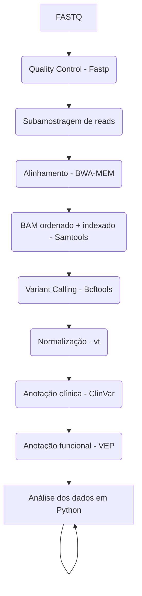

# Pipeline de Anotação de Variante (NGS)

Pipeline reprodutível para controle de qualidade, alinhamento, chamada de variante e anotação de variantes a partir de dados de sequenciamento NGS, implementado em ambiente Docker.

🎯 **Objetivos**
- Garantir reprodutibilidade por meio de containerização
- Executar um workflow completo de FASTQ → VCF anotado
- Aprendizado de alinhamento de sequência, chamada de variante e anotação de variante

🧰 **Tecnologias Utilizadas**  
**Bioinformática**
- Fastp – controle de qualidade e filtragem de reads
- BWA-MEM – alinhamento ao genoma de referência
- Samtools – manipulação, ordenação e indexação de BAM
- Bcftools – chamada e anotação de variantes
- vt – decomposição e normalização de variantes
- Ensembl VEP – predição de impacto funcional

**Análise de dados**  
Python (Em andamento)

**Infraestrutura**  
Docker + Miniconda para portabilidade e consistência de versões

🧬 **Referência Genômica**
- Montagem: GRCh38
- Para fins didáticos e otimização de recursos, foi utilizado apenas o cromossomo 20
- O FASTA foi indexado com: samtools faidx e bwa index

**Interpretação dos resultados**
As variantes identificadas concentram-se predominantemente em regiões não codificantes do genoma, não sendo esperado, portanto, impacto direto sobre a sequência de proteínas.
Foram detectadas 3.133 variantes no cromossomo 20, das quais 47 apresentam registro no ClinVar, enquanto a maioria não possui anotação clínica conhecida.
De acordo com a classificação do VEP, todas as variantes foram categorizadas com impacto MODIFIER, consistente com a localização majoritária em regiões intergênicas ou sem efeito funcional previsto.
Nenhuma variante foi classificada nas categorias HIGH ou MODERATE, indicando ausência de alterações com potencial efeito direto sobre produtos gênicos neste conjunto de dados.

A comparação com o banco ClinVar mostrou que a maioria das variantes não possui registro prévio. 
Entre as variantes anotadas, predominaram classificações benignas ou provavelmente benignas, com poucos registros de significado clínico incerto:

Benign:                                            24  
Likely_benign:                                     10  
Uncertain_significance:                            10  
Benign/Likely_benign:                               2  
Conflicting_classifications_of_pathogenicity:       1  

📊 **Visão Geral do Workflow**

