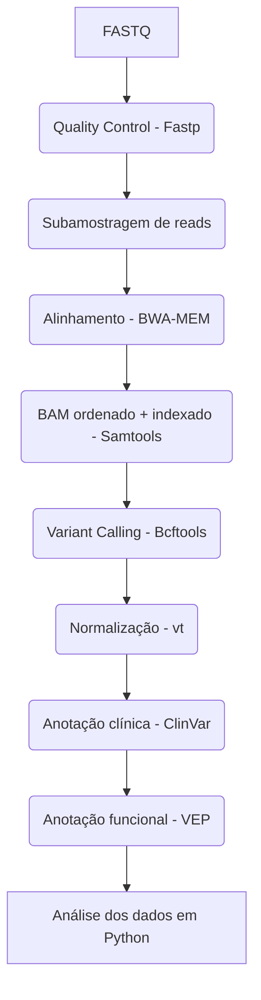

# Pipeline de Anotação de Variante (NGS)

Pipeline reprodutível para controle de qualidade, alinhamento, chamada de variante e anotação de variantes a partir de dados de sequenciamento NGS, implementado em ambiente Docker.

🎯 **Objetivos**
- Garantir reprodutibilidade por meio de containerização
- Executar um workflow completo de FASTQ → VCF anotado
- Aprendizado de alinhamento de sequência, chamada de variante e anotação de variante

🧰 **Tecnologias Utilizadas**  
**Bioinformática**
- Fastp – controle de qualidade e filtragem de reads
- BWA-MEM – alinhamento ao genoma de referência
- Samtools – manipulação, ordenação e indexação de BAM
- Bcftools – chamada e anotação de variantes
- vt – decomposição e normalização de variantes
- Ensembl VEP – predição de impacto funcional

**Análise de dados**  
Python (Em andamento)

**Infraestrutura**  
Docker + Miniconda para portabilidade e consistência de versões

🧬 **Referência Genômica**
- Montagem: GRCh38
- Para fins didáticos e otimização de recursos, foi utilizado apenas o cromossomo 20
- O FASTA foi indexado com: samtools faidx e bwa index

**Interpretação dos resultados**  
Foram analisadas 3.133 variantes genômicas localizadas no cromossomo 20. As variantes foram anotadas utilizando o Ensembl Variant Effect Predictor (VEP) e posteriormente analisadas em Python.

Registro clínico das variantes
* A maioria das variantes não possui registro clínico conhecido.
* Variantes com registro no ClinVar: 47
* Variantes sem registro clínico: 3086

Entre as variantes registradas no ClinVar, a maioria apresenta classificação benigna ou provavelmente benigna:  

Benign:                                            24  
Likely_benign:                                     10  
Uncertain_significance:                            10  
Benign/Likely_benign:                               2  
Conflicting_classifications_of_pathogenicity:       1  

Todas as variantes foram classificadas pelo VEP com IMPACT = MODIFIER, indicando que elas provavelmente estão em regiões não codificantes ou possuem impacto funcional baixo ou desconhecido. Nenhuma variante com impacto HIGH ou MODERATE foi identificada.

A análise da posição genômica mostrou que as variantes estão distribuídas ao longo de todo o cromossomo 20, com uma região de maior concentração próxima a 30 Mb. Essa distribuição pode refletir regiões com maior densidade de variação ou maior cobertura de sequenciamento.

📊 **Visão Geral do Workflow**

```mermaid
graph TD
    A[FASTQ] --> B(Quality Control - Fastp)
    B --> C(Subamostragem de reads)
    C --> D(Alinhamento - BWA-MEM)
    D --> E(BAM ordenado + indexado - Samtools)
    E --> F(Variant Calling - Bcftools)
    F --> G(Normalização - vt)
    G --> H(Anotação clínica - ClinVar)
    H --> I(Anotação funcional - VEP)
    I --> J[Análise dos dados em Python]
```
